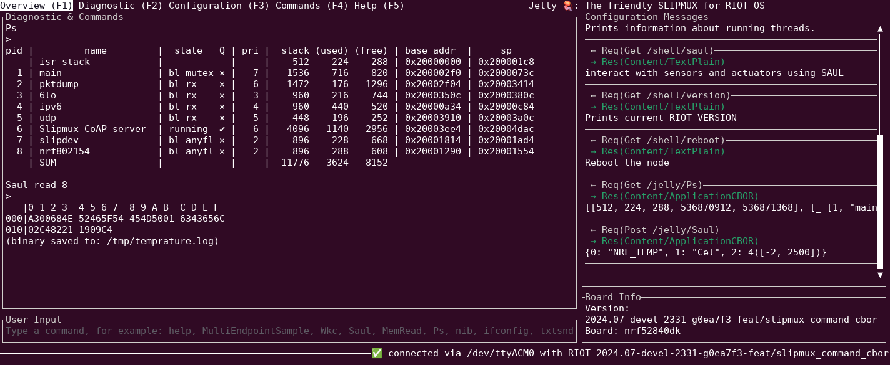

# Jelly 🪼

The friendly shell for constrained devices.
Pure Rust implementation of [draft-bormann-t2trg-slipmux-03](https://datatracker.ietf.org/doc/html/draft-bormann-t2trg-slipmux-03).

## What is Jelly?

Jelly is an utility that speaks [slipmux](https://datatracker.ietf.org/doc/html/draft-bormann-t2trg-slipmux-03) with an embedded device via UART. It presents itself as a regular shell with bonus features. Jelly tries to move the current [RIOT](https://github.com/RIOT-OS/RIOT) shell from the constrained device into the host computer.

## Usage

Clone the repository and change dir into it. Then type `cargo build` to compile. 

Run Jelly with `cargo run -- /dev/<tty>`. Or ask for usage info with `cargo run -- --help`.

## License

Licensed under either of

 * Apache License, Version 2.0
   ([LICENSE-APACHE](LICENSE-APACHE) or http://www.apache.org/licenses/LICENSE-2.0)
 * MIT license
   ([LICENSE-MIT](LICENSE-MIT) or http://opensource.org/licenses/MIT)

at your option.

## Contribution

Unless you explicitly state otherwise, any contribution intentionally submitted
for inclusion in the work by you, as defined in the Apache-2.0 license, shall be
dual licensed as above, without any additional terms or conditions.