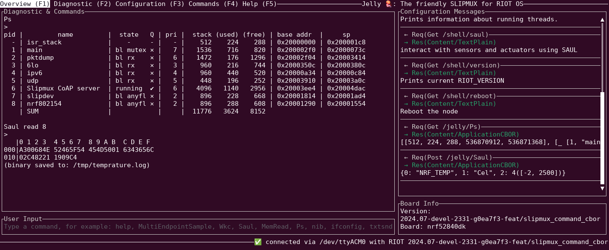

[](https://github.com/Teufelchen1/jelly/actions/workflows/rust.yml)
# Jelly 🪼

The friendly shell for constrained devices.

## What is Jelly?

Jelly is an utility that speaks [slipmux](https://datatracker.ietf.org/doc/html/draft-bormann-t2trg-slipmux-03) with an embedded device via UART. It presents itself as a regular shell with bonus features. Jelly tries to move the current [RIOT](https://github.com/RIOT-OS/RIOT) shell from the constrained device onto the host computer.


<p align="center">

## Installation

### From Crates.io

Install Jelly with `cargo install Jelly`.

Run Jelly with `Jelly /dev/<tty>`. Or ask for usage info with `Jelly --help`.

### From Git

Clone the repository and change dir into it. Then type `cargo build` to compile. 

Run Jelly with `cargo run -- /dev/<tty>`. Or ask for usage info with `cargo run -- --help`.

## Usage

Jelly can open serial devices and unix sockets. By default, Jelly will render a TUI as seen in the screenshot above. When using the TUI, running the command `Help` or pressing `F12` will open the help tab.

Jelly can also be used without the TUI, we call that mode of operation "headless". In headless mode, Jelly attaches the `stdin` and `stdout` to the current shell, allowing for transparent path through of the underlying data stream. Because slipmux offers three datastreams, Jelly offers three different headless modes:

* `Jelly --headless-diagnostic`: This wrappes the UTF-8 messages. It can be used to provide a backwards compatible shell experience with traditional embedded shell setups.
```txt
Margaret@Hamilton ~> Jelly /dev/ttyACM0 --headless-diagnostic
Serial connect with /dev/ttyACM0
main(): This is RIOT! (Version: 2024.07-devel-3656-g010af7-master)
Welcome to RIOT!
> version
version
2024.07-devel-3656-g010af7-master
> ^C⏎
Margaret@Hamilton ~> 
```
* `Jelly --headless-configuration`: This wrappes the CoAP-based configuration messages. Use this, when you want to use Jelly in scripts.
```txt
Margaret@Hamilton ~> echo "Wkc" | Jelly /dev/ttyACM0 --headless-configuration
</.well-known/core>
Margaret@Hamilton ~> 
```
* `Jelly --headless-network`: This provides the SLIP network functionality with a neat little tcpdump-style packet log. 
```txt
Margaret@Hamilton ~> Jelly /dev/ttyACM0 --headless-network --network slip0
Serial connect with /dev/ttyACM0
Using network interface slip0 fe80::cc13:b3c1:9fcc:a452.
[fe80::cc13:b3c1:9fce:a432] -> [fe80::2] 104 bytes | Icmpv6 EchoRequest TTL  64; 64 bytes
[fe80::cc13:b3c1:9fce:a432] <- [fe80::2] 104 bytes | Icmpv6 EchoReply TTL  64; 64 bytes
[fe80::cc13:b3c1:9fce:a432] -> [fe80::2] 104 bytes | Icmpv6 EchoRequest TTL  64; 64 bytes
[fe80::cc13:b3c1:9fce:a432] <- [fe80::2] 104 bytes | Icmpv6 EchoReply TTL  64; 64 bytes
^C⏎
Margaret@Hamilton ~> 
```

### Jelly --help

```txt
Usage: Jelly [OPTIONS] <TTY_PATH>

Arguments:
  <TTY_PATH>
          The path to the UART TTY interface

Options:
  -t, --network [<NETWORK>]
          If enabled, attaches the SLIP network to the given host TUN interface
          
          Default interface name is slip0

  -d, --headless-diagnostic
          If true, disables the TUI and passes diagnostic messages via stdio
          
          This is intended for interactive, shell-like usage.
          Jelly will await input and output indefinitely.
          Configuration messages are ignored. This means that any pre-known or
          configuration-based commands are not available.
          May be used with `--network`.

  -c, --headless-configuration
          If true, disables the TUI and passes configuration messages via stdio
          
          Use this mode inside scripts and pipe commands into Jelly.
          This may be used interactively.
          Jelly will await input unitl EOF.
          Jelly will wait for output until all commands are finished or
          the time-out is reached. The output will only be displayed once EOF is
          reached. This is to preserve the order of input commands regardless of
          the commands run time.
          Diagnostic messages are ignored.
          Pre-known, configuration-based commands are available.
          May be used with `--network`.

  -n, --headless-network
          If true, disables the TUI and shows the in-/out-going packets.
          
          Diagnostic messages are ignored.
          Configuration messages are ignored.
          Must be used with `--network`.

      --color-theme <COLOR_THEME>
          Sets the color theme of the Jelly TUI
          
          This setting has no effect when not using the TUI.
          
          [default: auto]
          [possible values: auto, light, dark, riot, none]

  -h, --help
          Print help (see a summary with '-h')

```

## License

Licensed under either of

 * Apache License, Version 2.0
   ([LICENSE-APACHE](LICENSE-APACHE) or http://www.apache.org/licenses/LICENSE-2.0)
 * MIT license
   ([LICENSE-MIT](LICENSE-MIT) or http://opensource.org/licenses/MIT)

at your option.

## Contribution

Unless you explicitly state otherwise, any contribution intentionally submitted
for inclusion in the work by you, as defined in the Apache-2.0 license, shall be
dual licensed as above, without any additional terms or conditions.